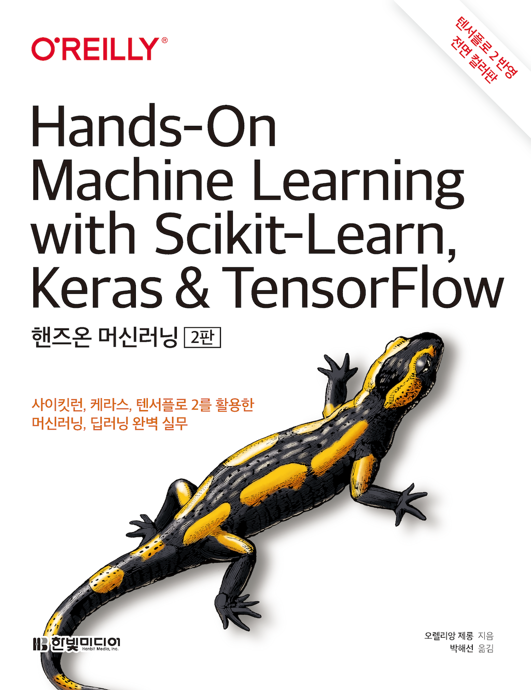

# Hands-On-ML
## 1. 교재

### 핸즈온 머신러닝(Hands-On Machine Learning)

## 2. 목차

### Part 1. 머신러닝
- Chap01 - [한눈에 보는 머신러닝](https://github.com/inhyeokJeon/Hands-On/tree/main/%5BCHAPTER%201%5D%20한눈에%20보는%20머신러닝)
- Chap02 - [머신러닝 프로젝트 처음부터 끝까지](https://github.com/inhyeokJeon/Hands-On/tree/main/%5BCHAPTER%202%5D%20머신러닝%20프로젝트%20처음부터%20끝까지)
- Chap03 - [분류](https://github.com/inhyeokJeon/Hands-On/tree/main/%5BCHAPTER%203%5D%20분류)
- Chap04 - [모델 훈련](https://github.com/inhyeokJeon/Hands-On/tree/main/%5BCHAPTER%204%5D%20모델%20훈련)
- Chap05 - [서포트 벡터 머신](https://github.com/inhyeokJeon/Hands-On/tree/main/%5BCHAPTER%205%5D%20서포트%20벡터%20머신)
- Chap06 - [결정 트리 Tree](https://github.com/inhyeokJeon/Hands-On/tree/main/%5BCHAPTER%206%5D%20결정%20트리)
- Chap07 - [앙상블 학습과 랜덤 포레스트](https://github.com/inhyeokJeon/Hands-On/tree/main/%5BCHAPTER%207%5D%20앙상블%20학습과%20랜덤%20포레스트)
- Chap08 - [차원 축소](https://github.com/inhyeokJeon/Hands-On/tree/main/%5BCHAPTER%208%5D%20차원%20축소)
- Chap09 - [비지도 학습](https://github.com/inhyeokJeon/Hands-On/tree/main/%5BCHAPTER%209%5D%20비지도%20학습)

### Part 2. 신경망과 딥러닝
- Chap10 - [케라스를 사용한 인공 신경망 소개](https://github.com/inhyeokJeon/Hands-On/tree/main/%5BCHAPTER%2010%5D%20케라스를%20사용한%20인공%20신경망%20소개)
- Chap11 - [심층 신경망 훈련하기](https://github.com/inhyeokJeon/Hands-On/tree/main/%5BCHAPTER%2011%5D%20심층%20신경망%20훈련하기)
- Chap12 - [텐서플로를 사용한 사용자 정의 모델과 훈련](https://github.com/inhyeokJeon/Hands-On/tree/main/%5BCHAPTER%2012%5D%20텐서플로를%20사용한%20사용자%20정의%20모델과%20훈련)
- Chap13 - [텐서플로에서 데이터 적재와 전처리 하기](https://github.com/inhyeokJeon/Hands-On/tree/main/%5BCHAPTER%2013%5D%20텐서플로에서%20데이터%20적재와%20전처리하기)
- Chap14 - [합성곱 신경망을 사용한 컴퓨터 비전](https://github.com/inhyeokJeon/Hands-On/tree/main/%5BCHAPTER%2014%5D%20합성곱%20신경망을%20사용한%20컴퓨터%20비전)
- Chap15 - [RNN과 CNN을 사용해 시퀀스 처리하기](https://github.com/inhyeokJeon/Hands-On/tree/main/%5BCHAPTER%2015%5D%20RNN과%20CNN을%20사용해%20시퀀스%20처리하기)
- Chap16 - [RNN과 어텐션을 사용한 자연어 처리](https://github.com/inhyeokJeon/Hands-On/tree/main/%5BCHAPTER%2016%5D%20RNN과%20어텐션을%20사용한%20자연어%20처리)
- Chap17 - [오토인코더와 GAN을 사용한 표현 학습과 생성적 학습](https://github.com/inhyeokJeon/Hands-On/tree/main/%5BCHAPTER%2017%5D%20오토인코더와%20GAN을%20사용한%20표현%20학습과%20생성적%20학습)
- Chap18 - [강화학습](https://github.com/inhyeokJeon/Hands-On/tree/main/%5BCHAPTER%2018%5D%20강화%20학습)
- Chap19 - [대규모 텐서플로 모델 훈련과 배포](https://github.com/inhyeokJeon/Hands-On/tree/main/%5BCHAPTER%2019%5D%20대규모%20텐서플로%20모델%20훈련과%20배포)

## 3. 참고자료

- **GitHub** : https://github.com/rickiepark/handson-ml/
- **Scikit-Learn** : http://scikit-learn.org
- **TensorFlow** : https://www.tensorflow.org
